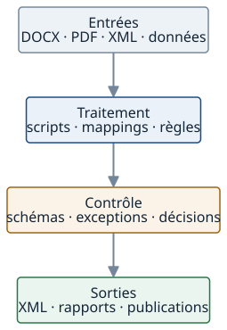

# Écrire et publier un article

## Source et sorties

Modifier uniquement `content/blog/<slug>.md` pour le contenu éditorial. Le nom du fichier doit correspondre au slug. Tous les `.md` de ce dossier sont publiables : garder les brouillons ailleurs. Ne pas y ajouter de README.

Generated file — do not edit manually : `blog/posts.json`, `blog/*/index.html`, `blog.html`, `sitemap.xml`. Ces quatre sorties sont produites par `npm run build:blog`. Le JSON est un artefact de compatibilité pour le JavaScript, jamais une seconde source.

Les templates restent dans `scripts/build-blog.js`, le contrat Markdown dans `scripts/blog-markdown.js`, et le design dans `assets/css/style.css`. Le site public reste 100 % statique, sans parseur Markdown, framework ou API IA côté navigateur.

## Exemple minimal

Créer `content/blog/comprendre-xslt.md` :

````markdown
---
title: "Comprendre XSLT : transformer un document XML"
slug: "comprendre-xslt"
description: "Le rôle de XSLT dans une chaîne de transformation XML."
meta_description: "Comprendre comment XSLT transforme un document XML, avec XPath, un modèle cible et des contrôles."
date: "2026-09-14"
category: "Transformation documentaire"
tags: ["XML", "XSLT"]
---

Introduction qui répond directement au sujet annoncé.

## À quoi sert XSLT ?

Expliquer la transformation avec un exemple, ses contraintes et ses limites.

### Un exemple XML

```xml
<product id="P-482">
  <name>Cooling pump</name>
</product>
```

## Sources de référence

- [W3C — XSLT 3.0](https://www.w3.org/TR/xslt-30/)
````

Cet exemple illustre le contrat, pas un article prêt à publier. Remplacer la date et le contenu par les informations réelles.

## Frontmatter

Obligatoires : `title`, `slug`, `description`, `meta_description`, `date`, `category`, `tags`.

- Chaînes non vides pour les textes ; `tags` est une liste non vide de chaînes distinctes (sans `|`).
- Slug en minuscules ASCII : lettres, chiffres, tirets simples entre les mots, sans tiret initial/final. Exemple : `xml-ou-json`.
- Dates réelles au format `YYYY-MM-DD`, avec ou sans guillemets. `updated` est facultatif et ne précède pas `date` ; absent, la date de publication est reprise. Une génération ne modifie jamais ces dates.
- `description` alimente le résumé visible et les cartes ; `meta_description` alimente les métadonnées SEO/sociales.
- Champs inconnus refusés pour détecter les fautes de frappe. Ne pas renseigner `content_html`, `reading_time`, `canonical` ou un H1 ailleurs.
- `order` : entier facultatif, utilisé pour préserver l’ordre historique des six articles et leurs relations précédent/suivant. Les cartes restent triées par date, puis par cet ordre en cas d’égalité. Sans `order`, les articles viennent après les ordres explicites, départagés par slug. Aucun fichier de relations séparé.

Associations facultatives, avec valeurs complètes si présentes :

```yaml
updated: "2026-09-15"
service:
  url: "services.html#transformation"
  label: "Transformation et conversion XML"
demonstration:
  url: "demonstrations.html#transformation-xml"
  label: "Transformation XML"
contact:
  label: "Évaluer une transformation"
  context: "Un exemple source et la cible attendue permettent de cadrer le besoin."
```

Sans association, les liens génériques Prestations et Démonstrations restent disponibles. Le bloc de contact n’est affiché que s’il est renseigné.

## Markdown et composants

Le `title` génère l’unique H1. Le corps commence par l’introduction (premier paragraphe rendu en `.lead`), puis `##`, `###` et éventuellement `####`, sans saut de niveau. Les H2/H3 éditoriaux alimentent le sommaire ; les H4 restent ancrés. Les accents sont normalisés, les doublons suffixés de façon stable.

Paragraphes, listes ordonnées/non ordonnées, gras, italique, liens, code inline, code clôturé, tableaux, citations et séparateurs sont pris en charge. Le code est affiché en `<pre><code>` échappé, sans moteur lourd de coloration. Les tableaux défilent localement sur mobile.

Une note utilise une citation dont le premier paragraphe est exactement l’un de ces libellés en gras : À retenir, Note, Attention, Limite, Exemple.

```markdown
> **À retenir**
>
> Le contrôle structurel ne remplace pas la validation métier.
```

Pipeline : une étape en texte brut par ligne, clôture obligatoire.

```markdown
:::pipeline
XML SOURCE
XPATH
XSLT
PDF
:::
```

Tableau Markdown standard possible ; pour conserver une légende accessible :

```markdown
:::table Correspondances entre les deux modèles
| Source | Règle | Cible |
| --- | --- | --- |
| `part/@id` | copie obligatoire | `item/code` |
:::
```

La première cellule d’une ligne de données, si elle contient uniquement du **gras**, devient un en-tête de ligne `<th scope="row">`. Les en-têtes de colonnes reçoivent `scope="col"`. Sans légende explicite, le template ajoute une légende générique masquée visuellement.

## Liens et images

Dans le frontmatter et le corps, les liens internes partent de la racine logique du site, sans `/` initial ni `../../` :

```markdown
[Prestation](services.html#controle)
[Autre article](blog/xml-ou-json/#comparer-la-validation)
[Section de cet article](#sources-de-reference)

```

Le build calcule les chemins depuis `/blog/<slug>/`. Il vérifie fichiers et fragments, y compris les liens entre articles nouvellement générés. Les URLs externes HTTP(S) et les liens mailto sont autorisés dans le corps ; aucune requête externe n’est faite au build. Les URLs d’associations restent internes. Pas de paramètres de requête pour les liens internes.

Images locales PNG ou SVG uniquement pour ce contrat initial : texte alternatif obligatoire, dimensions lues au build, chargement différé. Le PNG convient aux captures ; Mermaid continue de produire des SVG avec `npm run build:diagrams`, jamais dans le navigateur. Une légende visible peut être rédigée comme paragraphe sous l’image.

## Sécurité et erreurs

HTML brut désactivé : les balises écrites dans le Markdown sont affichées comme du texte et non exécutées. Les composants n’acceptent que leur structure contrôlée ; leurs libellés sont échappés. Markdown-it bloque les protocoles dangereux. Frontmatter YAML strict, clés uniques, aucun tag personnalisé ni alias accepté. Les chemins ne peuvent pas remonter hors du site.

Les SVG et autres assets restent des fichiers revus par PPR-Solution ; ce build n’est pas un service d’hébergement de fichiers non fiables. Les dépendances Markdown/YAML sont des dépendances de développement, verrouillées dans `package-lock.json` et compatibles avec Node 20.15 utilisé lors de la migration.

Exemple d’échec : `ERROR article "xml-ou-json.md": missing required field: meta_description`. Les validations éditoriales s’exécutent avant l’écriture des sorties. Une erreur interrompt le build avec un code non nul.

## Publication

Le fichier racine `.nojekyll` est obligatoire : GitHub Pages doit servir les fichiers HTML déjà générés, sans convertir une seconde fois `content/blog/*.md` en pages HTML concurrentes. Ne pas le supprimer. Voir la [documentation GitHub Pages](https://docs.github.com/en/pages/getting-started-with-github-pages/creating-a-github-pages-site).

```bash
npm ci
npm run build:blog
npm test
```

Relire le rendu local (`python -m http.server 8000`), vérifier le diff, puis commiter le Markdown et les fichiers générés ensemble. Pousser le commit pour publier selon le workflow GitHub Pages du dépôt. `npm run build:blog` doit produire les mêmes octets à chaque exécution avec les mêmes sources.

Le temps de lecture suit la convention existante : 220 mots/minute, minimum une minute, calcul sur le contenu éditorial rendu (code, tableaux et notes inclus), hors navigation, sommaire et CTA.

Retirer un Markdown retire automatiquement son entrée du JSON, de l’index et du sitemap. Le build ne détruit pas une ancienne page HTML sur disque : avant de dépublier une URL déjà référencée, décider de sa conservation, de sa redirection ou de sa suppression explicite. Les anciennes pages ne sont pas des sources du build. Ne pas changer un slug publié sans traiter les liens existants.

## SEO et visibilité dans les recherches

Les lecteurs et robots reçoivent immédiatement le texte intégral en HTML. Les cartes contiennent tous les liens d’articles sans JavaScript ; recherche, filtres et pagination sont une amélioration progressive. Canonical, title, meta description, Open Graph, Twitter Card, dates et JSON-LD BlogPosting/Organization/BreadcrumbList sont générés depuis les métadonnées ; les liens et ancres historiques restent stables. Le sitemap reprend tous les Markdown et reste déclaré dans robots.txt.

Pour les prochains articles : traiter une question précise, y répondre clairement dès l’introduction, apporter un exemple vérifiable, décrire les limites et citer les sources primaires. Employer les termes que le public utilise sans bourrage de mots-clés ; relier les articles pertinents, prestations et démonstrations réelles. Ne pas inventer auteur, certification ou résultat.

Ces éléments facilitent l’exploration et la compréhension ; ils ne garantissent ni indexation, ni classement sur une requête, ni citation par une IA. Google indique que les pratiques SEO habituelles s’appliquent à ses fonctionnalités IA et n’exige pas de fichier spécial pour elles : [AI features and your website](https://developers.google.com/search/docs/appearance/ai-features). Aucune directive artificielle ni fichier llms.txt n’est ajouté par cette migration.

Après publication, le propriétaire peut soumettre le sitemap et inspecter les URL dans Google Search Console, puis suivre requêtes, impressions, clics et pages réellement indexées. Ce suivi nécessite l’accès à la propriété ; il n’est pas effectué par le build. Voir [les exigences techniques de Google](https://developers.google.com/search/docs/essentials/technical).

## Contrat pour un outil de rédaction

Le futur `ppr-technical-blog-author`, comme un auteur humain, doit produire uniquement un Markdown conforme dans `content/blog/`. Il ne modifie pas les sorties. Le build est autonome : aucune connexion à un assistant ou à une API n’est nécessaire.
